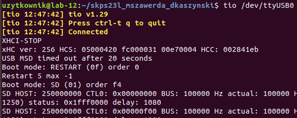
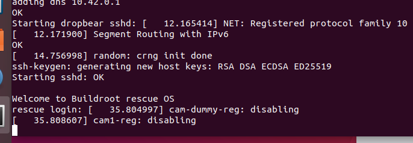
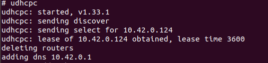
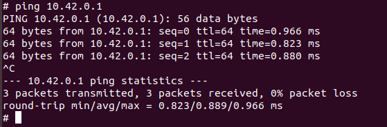
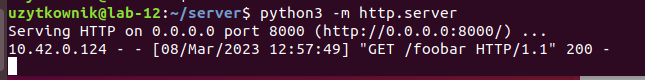
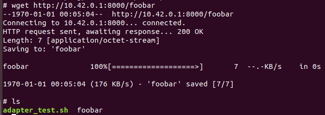
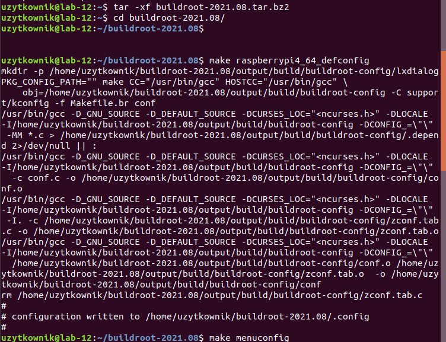

# Lab1
## Dawid Kaszyński Mikołaj Szawerda

### Uruchomienie RPi

Do terminala UART podłączyliśmy się wykonując komendę `tio /dev/ttyUSB01`



Po uruchomieniu zasialania na RPi został uruchomiony system ratunkowy, zalogowaliśmy się na niego z loginem root, a następnie wykonaliśmy polecenie `udhcp`, by został przyznany adres IP





Sprawdzenie utworzenia podsieci między hostem a RPi.



### Kopiowanie plików

#### Test

W celu przetestowania przesyłania plików utworzyliśmy serwer http przy pomocy polecenia `python3 -m http.server`, następnie na hoscie utworzyliśmy plik testowy `foobar`, umieściliśmy go na serwerze, i na RPi pobraliśmy go korzystając z komendy `wget http://10.42.0.1:8000/foobar`





### Kompilacja obrazu Linuxa

- po rozpakowaniu archiwum z Buildroota, wykorzystaliśmy predefiniowaną konfigurację domyślną dla RBi4 oraz uruchomiliśmy menu konfiguracji
```
make raspberrypi464defconfig
make menuconfig
```



#### Wersja initramfs

Kroki:
- w meny wybranie `Toolchain --> Toolchain type: External toolchain`
- w filesystem images: zaznaczenie cpio, opcji initramfs i wyłączenie ext2/3/4, włączenie kompresji obrazu: gzip
- zapis ustawień w `.config` i urochomienie kompilacji `make`
- zamontowaliśmy partycję 1 w /mnt przy pomocy `mount /dev/mmcblk0p1 /mnt`
- skompilowany obraz `Image` pod nazwą `kernel8.img`, linię poleceń `cmdline.txt` z katologu `rpi-firmware`  i drzewo urządzeń `bcm2711-rpi-4-b.dtb` pobraliśmy z poziomu systemu ratunkwoego do katologu `/user`
- zrestartowaliśmy RBi4 `reboot` z wciśniętym przyciskiem `sw4`

#### Wersja bez initramfs

Kroki:
- usuneliśmy poprzedni obraz systemy `make linux-dirclean`
- z poprzedniej konifguracji pozostawiliśmy włączony External toolchain, oraz kompresję obrazu w Kernel
- w filesystem images: wyłączyliśmy initramfs, włączyliśmy ext2/3/4
- `make`
