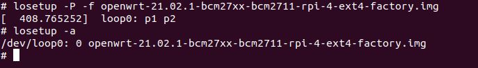
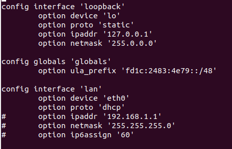
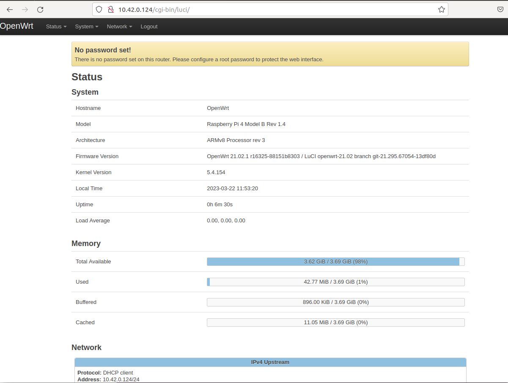

## Lab 2
## Dawid Kaszyński Mikołaj Szawerda


### Instalacja OpenWRT z wykorzystaniem systemu ratunkowego

Pobraliśmy obraz systemu poleceniem
`wget
https://downloads.openwrt.org/releases/21.02.1/targets/bcm27xx/bcm2711/openwrt-21.
02.1-bcm27xx-bcm2711-rpi-4-ext4-factory.img.gz --no-check-certificate`.

Konieczne było dodanie w pliku `/etc/resolv.conf`
linii `nameserver 8.8.8.8` oraz użycie flagi `--no-check-certificate`.

Zdekompresowaliśmy pobrany obraz poleceniem `gzip -d openwrt-21.02.1-bcm27xx-bcm2711-rpi-4-ext4-factory.img.gz`.

Załadowaliśmy jako urządzenie "loop"
`losetup -P -f openwrt-21.02.1-bcm27xx-bcm2711-rpi-4-ext4-factory.img`.

Stan urządzeń sprawdzony poleceniem `losetup -a`



Zkopiowaliśmy partycję z rootfs z obrazu OpenWRT na kartę SD, na partycję 2 `dd if=/dev/loop0p2 of=/dev/mmcblk0p2 bs=4096`.

Stworzyliśmy katalogi `mnt/boot` oraz `/mnt/owrt` i zmontowaliśmy odpowiednie partycje.

Zkopiowaliśmy pliki z obrazu OpenWRT do katalogu user na partycji boot:
```
cp /mnt/owrt/cmdline.txt /mnt/boot/user/

cp /mnt/owrt/kernel8.img /mnt/boot/user/

cp /mnt/owrt/bcm2711-rpi-4-b.dtb /mnt/boot/user/
```

Powiększyliśmy partycję poleceniem `resize2fs /dev/mmcblk0p2`.

Wykonaliśmy `reboot`.

Zkonfigurowaliśmy sieć edytując plik `/etc/config/network`.



Zrestartowaliśmy sieć poleceniem `/etc/init.d/network reload`.

### Interfejs HTTP dla OpenWRT




### Eksperymenty w OpenWRT


Wykonaliśmy polecenie `opkg update`, a następnie zainstalowaliśmy pakiety python, pip.

### Obsługa GPIO przez sysfs

Uruchomiliśmy obsługę pinu 27 poleceniem
`echo 27 > /sys/class/gpio/export`

Ustawiliśmy kierunek na wyjście `echo out > /sys/class/gpio/gpio27/direction`.

Bieżąca wartośc wynosi 0 - po sprawdzeniu poleceniem `cat /sys/class/gpio/gpio27/value`.

Włączyliśmy diodę `echo 1 > /sys/class/gpio/gpio27/value` - zaświeciła się.

Zwolniliśmy zasoby poleceniem `echo 27 > /sys/class/gpio/unexport`.

### Obsługa GPIO w Pythonie

Najpierw zainstalowaliśmy bibliotekę gpio4 poleceniem `pip install gpio4`.


### Zadania - obsługa akcesoriów

Rozwiązania zadań 1-5 znajdują się w katalogu w plikach
- `gpio_led_1.py`
- `gpio_led_2.py`
- `gpio_buzzer.py`
- `gpio_in.py`
- `gpio_servo.py`
