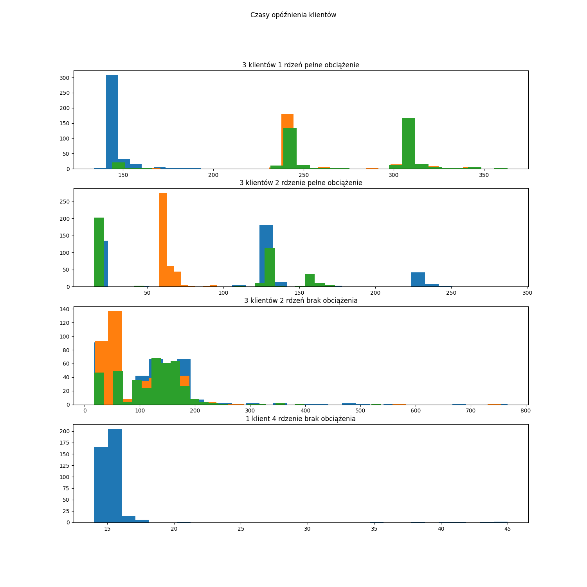
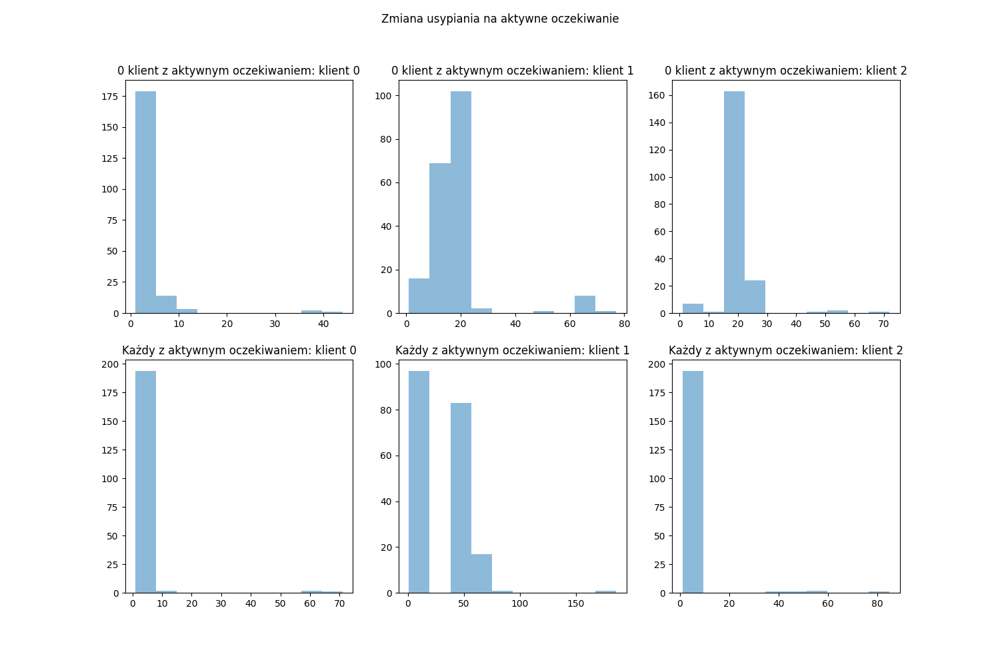
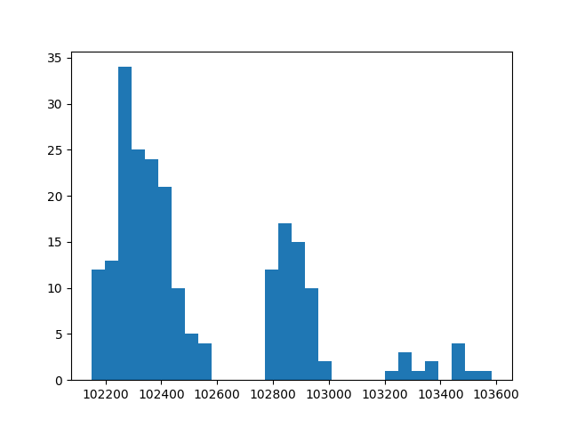

# Lab4
## Testowanie na gospodarzu
```
make all
export PATH=$PATH:~/cw4b
./cw4a 5 10 10000 100
```

Program się uruchomił i wygenerował pliki

## Stworzenia pakiety

Pobraliśmy SDK OpenWRT, wykonaliśmy `make clean` i skompilowaliśmy pakiet dla OpenWRT

## Ustalenie granicznej wartości

### 3 klientów, 1 rdzeń, pełne obciążenie
`stress-ng --matrix 0 -t 7s & cw4a 3 250 10000 260000`
### 3 klientów, 2 rdzeń, pełne obciążenie
`stress-ng --matrix 0 -t 7s & cw4a 3 250 10000 290000`
### 3 klientów, 2 rdzeń, bez obciążenia
`cw4a 3 250 10000 500000`
### 1 klientów, 4 rdzeń, bez obciążenia
`cw4a 1 250 10000 750000`

|# klientów|# rdzeni|obciążenie|Czas przetwarzania|
| --- | --- | --- | --- |
|3|1|pełne|260000|
|3|2|pełne|290000|
|3|2|bez|500000|
|1|4|bez|750000

## Rozkład czasu dostarczania



## Modyfikacja programu z aktywnym oczekiwaniem

Dodanie aktywnego oczekiwanie przyspieszyło odbieranie danych z serwera. Przyspieszenie to wynika również z tego, że procesor jest w stanie obsłużyć każdego z klientów.



## Nieprawidłowy rozkład czasów dostarczania

Nieprawidłowy rozkład wynika z zastosowania `usleep`, który nie gwarantuje terminowego wybudzenia

### Nieprawdiłowy rozkład


