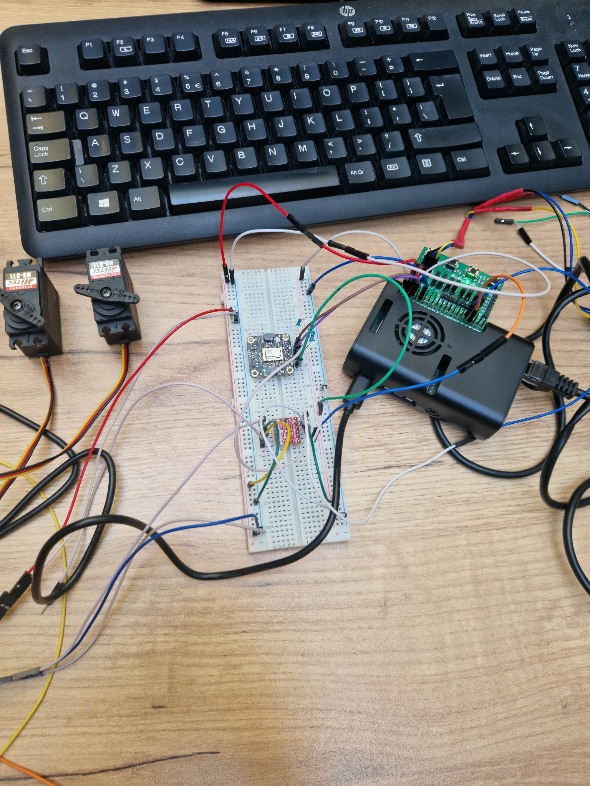
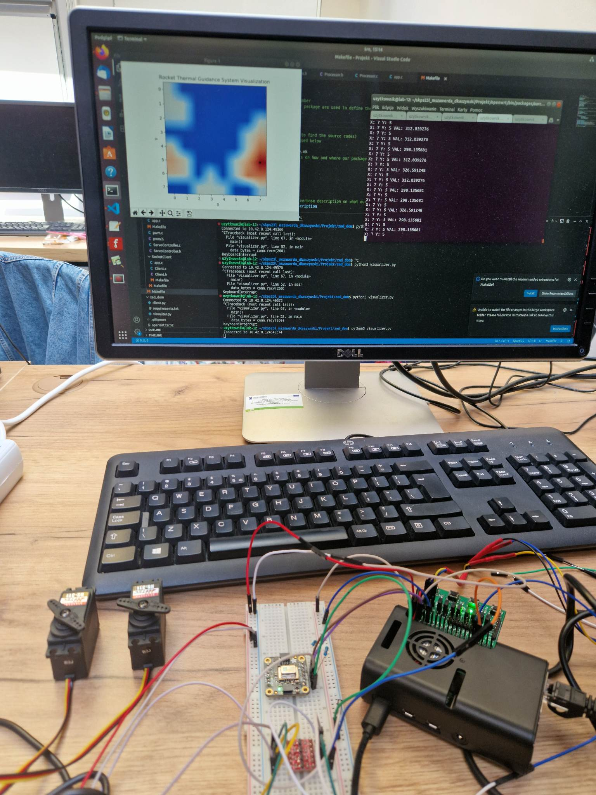

Mikołaj Szawerda  
Dawid Kaszyński

# Projekt SKPS - Termiczny układ naprowadzania rakiety

## Założenia projektu

Projekt ma za zadanie symulować termiczny układ naprowadzania rakiety poprzez zczytywanie danych z kamery termowizyjnej i odpowiednie sterowanie dwoma serwomechanizmami w taki sposób, żeby nakierowywać w najcieplsze miejsce w obrazie. Ponadto system powinien wizualizować w czasie rzeczywistym przetwarzany obraz oraz wyświetlać wybrany cel.

## Wykonanie - zdjęcia

### Urządzenie i podłączone serwomechanizmy oraz kamera

### Urządzenie wraz z widoczną wizualizacją i najcieplejszym punktem (czarna kropka na mapie ciepła)

## Wizualizacja

Wizualizacja w czasie rzeczywistym została zrealizowana przy pomocy połączenia RPi4 z hostem poprzez socket oraz z użyciem biblioteki matplotlib, która umożliwa wyświetlenie mapy ciepła 8x8 z włączoną interpolacją i odpowiednią kolorystyką.

Dane wysyłąne z płytki poprzez sockety to bufor 65-bajtowy, z czego pierwsze 64 bajty to dane odczytane z kamery termowizyjnej, a ostatni bajt to połozenie najciepleszego punktu, który w wizualizacji jest reprezentowany przez czarną kropkę.

## Algorytm wyszukiwania najcieplejszego punktu

Pierwszym, najprostszym pomysłem na realizację algorytmu wyszukiwania najcieplejszego punktu było zwykłe wyszukiwanie najcieplszego pixela odczytanego z kamery. Dawało to jednak złe rezultaty, ze względu na bardzo dużą oscylację odczytów i brak możliwości skupienia się na konkretnym punkcie, gdy w zasięgu kamery pojawiały się inne o zbliżonej temperaturze.

Z tego względu zdecydowaliśmy się na rozwiązanie polęgające na iteracji po całym obrazie 8x8 macierzą 3x3 i uwzględnianie średniej ważonej temperatury z całego mniejszego obszaru. Ponadto, parametrem algorytmu jest najcieplejszy punkt z poprzedniego odczytu, który powoduje, że w przypadku występowania dwóch równie ciepłych punktów w obrazie z kamery, algorytm preferuje wybór tego, który był wybrany poprzednio - umożliwia to skupienie się na konkretnym punkcie i redukuje oscylację. Co iterację wartość poprzedniego najcieplejszego punktu jest delikatnie zmniejszana poprzez mnożenie przez pewien współczynnik, aby wykluczyć zapamiętywanie punktów, które nie istnieją już w nowym odczycie z kamery.

Dodatkowym usprawnieniem jest także progowanie - odcianie temperatury do przedziału [a, b], które powoduje, że obraz jest mniej rozmyty i można lepiej rozróżnić ciepłe obszary.