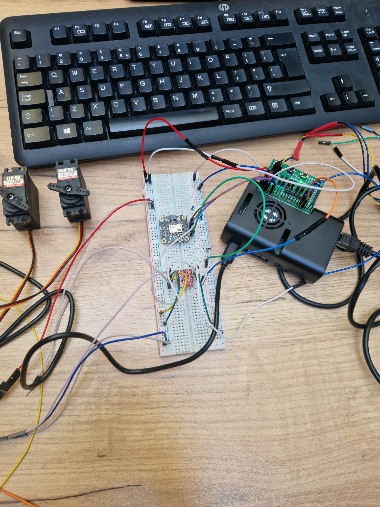
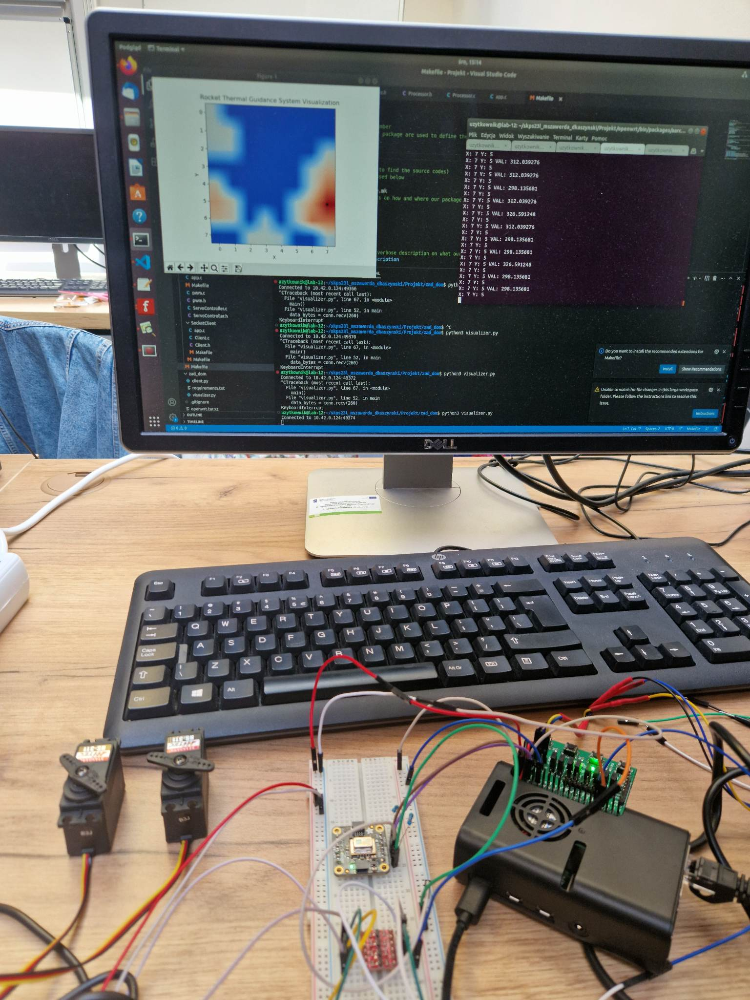
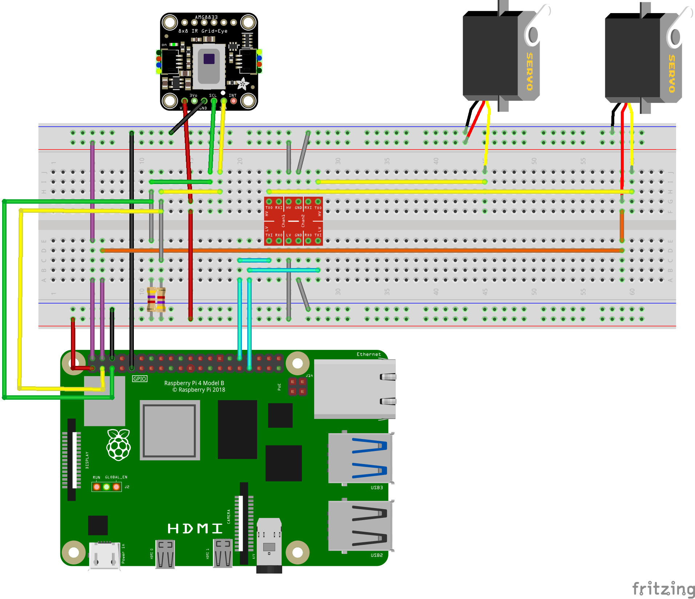

Mikołaj Szawerda  
Dawid Kaszyński

# Projekt SKPS - Termiczny układ naprowadzania rakiety

## Założenia projektu

Projekt ma za zadanie symulować termiczny układ naprowadzania rakiety poprzez zczytywanie danych z kamery termowizyjnej i odpowiednie sterowanie dwoma serwomechanizmami w taki sposób, żeby nakierowywać w najcieplsze miejsce w obrazie. Ponadto system powinien wizualizować w czasie rzeczywistym przetwarzany obraz oraz wyświetlać wybrany cel.

## Wykonanie - zdjęcia

### Urządzenie i podłączone serwomechanizmy oraz kamera

### Urządzenie wraz z widoczną wizualizacją i najcieplejszym punktem (czarna kropka na mapie ciepła)

## Wykonanie - płytka

- kamera z racji komunikacji po I2C jest podłączona wraz z pull up resistorami do lini SCL i SDA
- servomechanizmy z racji wymaganego sterovania 5V są podłączone do RPI poprzez konwerter poziomów logicznych z 3.3V na 5V

## Wizualizacja

Wizualizacja w czasie rzeczywistym została zrealizowana przy pomocy połączenia RPi4 z hostem poprzez socket oraz z użyciem biblioteki matplotlib, która umożliwa wyświetlenie mapy ciepła 8x8 z włączoną interpolacją i odpowiednią kolorystyką.

Dane wysyłąne z płytki poprzez sockety to bufor 65-bajtowy, z czego pierwsze 64 bajty to dane odczytane z kamery termowizyjnej, a ostatni bajt to połozenie najciepleszego punktu, który w wizualizacji jest reprezentowany przez czarną kropkę.

## Algorytm wyszukiwania najcieplejszego punktu

Pierwszym, najprostszym pomysłem na realizację algorytmu wyszukiwania najcieplejszego punktu było zwykłe wyszukiwanie najcieplszego pixela odczytanego z kamery. Dawało to jednak złe rezultaty, ze względu na bardzo dużą oscylację odczytów i brak możliwości skupienia się na konkretnym punkcie, gdy w zasięgu kamery pojawiały się inne o zbliżonej temperaturze.

Z tego względu zdecydowaliśmy się na rozwiązanie polęgające na iteracji po całym obrazie 8x8 macierzą 3x3 i uwzględnianie średniej ważonej temperatury z całego mniejszego obszaru. Ponadto, parametrem algorytmu jest najcieplejszy punkt z poprzedniego odczytu, który powoduje, że w przypadku występowania dwóch równie ciepłych punktów w obrazie z kamery, algorytm preferuje wybór tego, który był wybrany poprzednio - umożliwia to skupienie się na konkretnym punkcie i redukuje oscylację. Co iterację wartość poprzedniego najcieplejszego punktu jest delikatnie zmniejszana poprzez mnożenie przez pewien współczynnik, aby wykluczyć zapamiętywanie punktów, które nie istnieją już w nowym odczycie z kamery.

Dodatkowym usprawnieniem jest także progowanie - odcianie temperatury do przedziału [a, b], które powoduje, że obraz jest mniej rozmyty i można lepiej rozróżnić ciepłe obszary.

## Aplikacja na RPI

Aplikacja uruchomiona na RPI została podzielona na moduły, znajdujące się w folderze `thermo_guide/src`

### SocketClient
- implementacja klienta komunikującego się po TCP socketami. Klient umożliwia przesłanie przetwarzanych przez niego danych(obrazu z kamery) i końcowego rezultatu algorytmu - piksela na który zostają nastawione serwa(indeks w buforze z obrazem)
- w folderze z kodem znajduje się również aplikacja testująca samego klienta - generuje sztuczny obraz(orbitujący punkt) wraz z losowym szumem i przesyła go po socketcie

### ServoController
- moduł z funkcjami umożliwiającymi sterowanie serwami
- funkcje korzystają z fragmentu biblioteki `C-periphery` w celu wysterowania odpowiedniego sygnału PWM.
- funkcja `init_servo` rozpoczyna komunikację programu z chipem pwm i ustawia częstotliwość pracy PWM
- ponieważ nie posiadaliśmy informacji o typie serva przed laboratoriami przygotowaliśmy funkcję sterujące servem w trybie ciągłym i wychyleniowym
- `set_servo_rot_direction` ustawia wypełnienie serva, decydując o jego wychyleniu
- `step_set_servo_pixel` mapuje wymagane wychylenie do wypełnienia z przedziału `[MIN_ANGLE, MAX_ANGLE]`
- folder zawiera również aplikację testową do zbadania minimalnego i maksymalnego wypełnienia dającego zmianę wychylynie

### ImageProcessor
- moduł z implementacją algorytmu znajdowania najcieplejszego punktu
- folder zawiera również aplikację do testowania funkcjonalności

### Camera
- moduł do pobierania danych z kamery wykorzystując I2C
- pakiet jest fuzją oficjalnej biblioteki do kamery w C i części biblioteki `C-periphery` do obsługi protokołu I2C.
- folder zawiera aplikację testującą odczytywane dane

### App
- główna aplikacja wykorzystująca zaimplementowane funkcjonalności
- przepływ aplikacji:
    - inicjacja połączenia z serverm na hoscie
    - inicjacja urządzenia I2C i sygnału PWM dla serv
    - w pętli:
        - odczyt z kamery
        - przetworzenie obrazu i odebranie najcieplejszego punkty
        - wysterowanie serv i wysyłka pakietu do servera
        - odczekanie w celu równomiernego próbkowania obrazu

### Pozostałe
- w celu ułatwienia i przyspieszenia pracy z OpenWRT w folderze `scripts/` znajdują shell'owe skrypty
